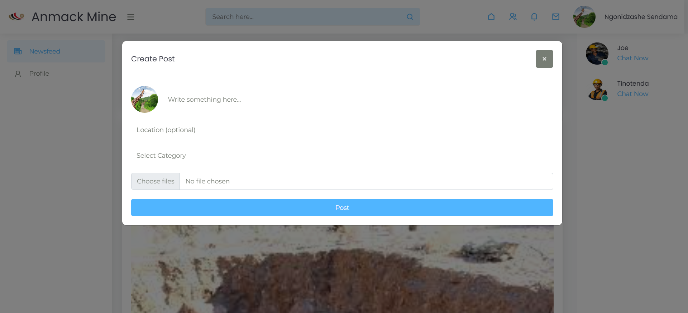
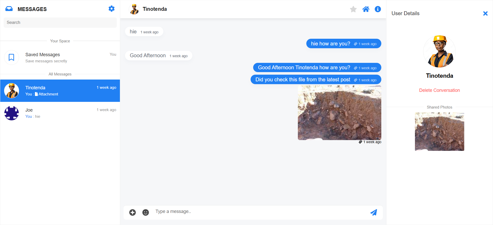
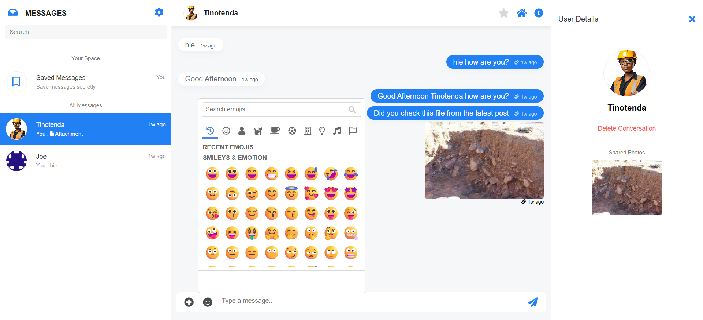

# Intranet Powered By Laravel
An intranet is a private network accessible only to an organization’s members, typically used to share information, resources, and tools securely within the organization

## Features

- Chatting App
- Notifications
- Social Media posts
- Likes and Comments

## Images






# How to install

clone the project and add pusher creds from [Pusher](https://pusher.com/) and make sure to enable client events in App Settings/ as shown below


 
and paste here in your .env file

```php 
PUSHER_APP_ID=
PUSHER_APP_KEY=
PUSHER_APP_SECRET=
PUSHER_APP_CLUSTER=
PUSHER_PORT=
PUSHER_SCHEME=
```