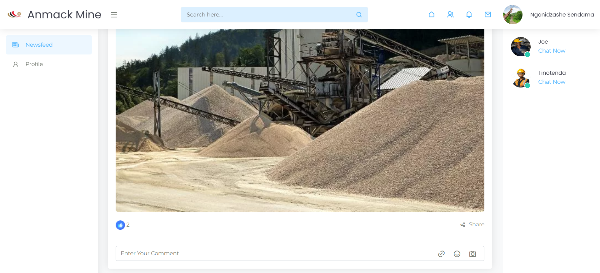

# Intranet Powered By Laravel
An intranet is a private network accessible only to an organization’s members, typically used to share information, resources, and tools securely within the organization

## Features

- Chatting App
- Notifications
- Social Media posts
- Likes and Comments

## Images

